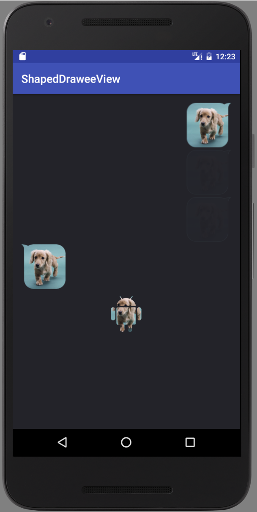

# ShapedDraweeView

Fresco custom view with mask shape.

## Demo



## Usage

### Dependency

``` gradle
allprojects {
    repositories {
        jcenter()
    }
}

compile 'com.github.piasy:ShapedDraweeView:1.2.0'
```

### Layout

``` xml
<com.github.piasy.fresco.draweeview.shaped.ShapedDraweeView
        android:id="@+id/mShapedDraweeView"
        android:layout_width="100dp"
        android:layout_height="100dp"
        app:placeholder="@drawable/placeholder"
        app:maskShape="@drawable/mask"
        />
```

### Java

``` java
ShapedDraweeView shapedDraweeView = (ShapedDraweeView) findViewById(R.id.mShapedDraweeView);
DraweeController controller = Fresco.newDraweeControllerBuilder()
        .setUri(Uri.parse(
                "http://img0.bdstatic.com/img/image/shouye/xinshouye/chongwu16830.jpg"))
        .build();
shapedDraweeView.setController(controller);
```

## SVG support

import a SVG drawable as vector drawable via AndroidStudio.

`app/build.gradle`

``` gradle
android {
    // ...

    defaultConfig {
        // ...

        vectorDrawables.useSupportLibrary = true
    }

    // ...
}
```

Then set the `app:maskShape` value as a vector drawable.

Full example is inside [example module](tree/master/example)

## Credit

1. Shape mask is from: https://github.com/siyamed/android-shape-imageview
2. Fresco custom view is from: http://fresco-cn.org/docs/writing-custom-views.html
